# Wazuh Cloud Deployment – SOC Lab

## Overview
This project demonstrates the deployment of a **Wazuh Cloud SIEM environment**, enrollment of a **Windows endpoint agent**, and validation of **log collection, alert generation, and File Integrity Monitoring (FIM)**.  

The lab was completed as **Task 5 of the WazuGuardix SOC Internship Program**, focusing on real-world **SOC Analyst (L1)** workflows using a cloud-based SIEM platform.

---

## Objectives
- Deploy a Wazuh Cloud environment  
- Enroll and configure a Windows agent  
- Verify agent connectivity and log collection  
- Generate authentication failure alerts  
- Configure and test File Integrity Monitoring (FIM)  
- Validate dashboard visibility and alerting  

---

## Environment & Tools

| Component | Details |
|---------|--------|
| SIEM Platform | Wazuh Cloud |
| Agent OS | Windows 10 (64-bit) |
| Virtualization | Oracle VirtualBox |
| Agent | Wazuh Windows Agent |
| Monitoring | Authentication logs, FIM |
| FIM Path | `C:\Users\Public` |

---

## Lab Walkthrough with Screenshots
### Wazuh Cloud Setup

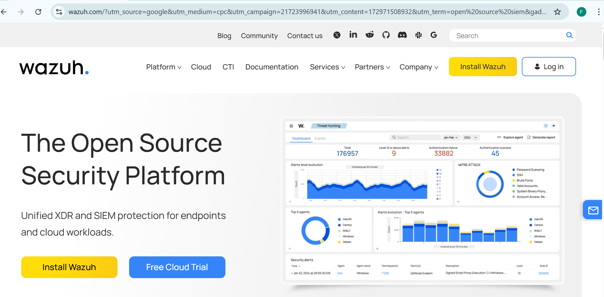
*Accessing the Wazuh official website to start a free cloud trial.*

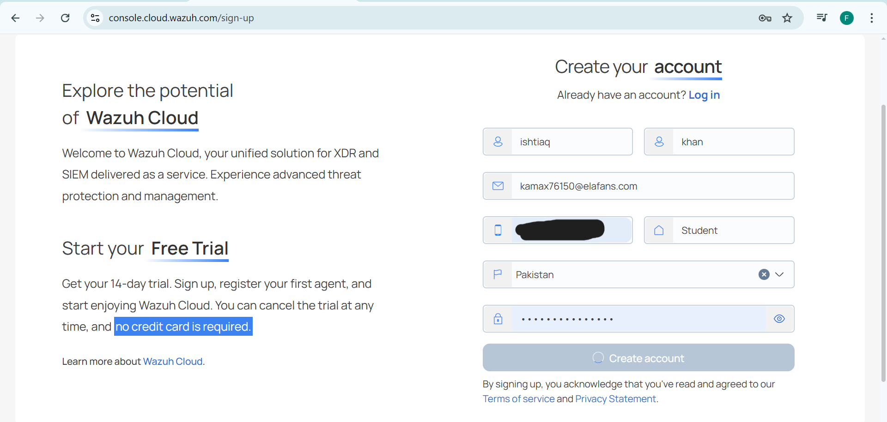
*Creating a Wazuh Cloud account to deploy the SIEM environment.*

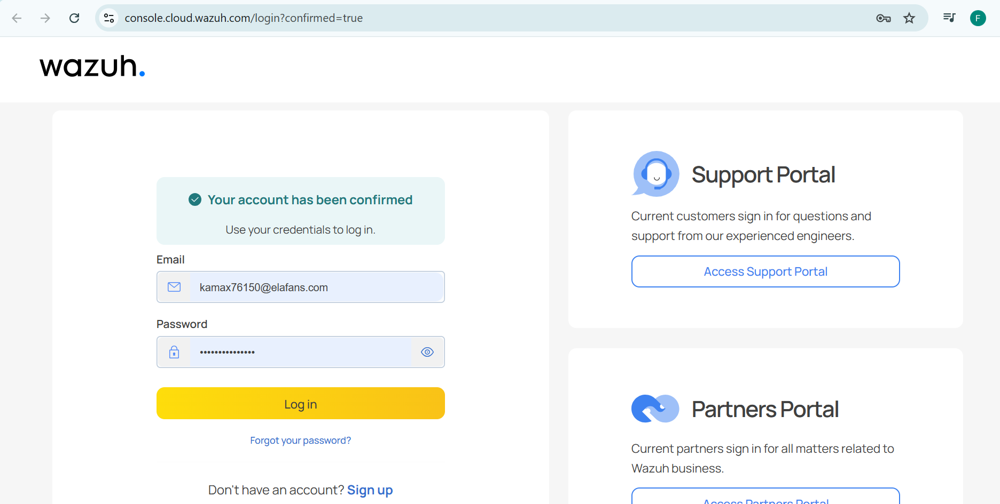
*Successful account verification and login into Wazuh Cloud.*

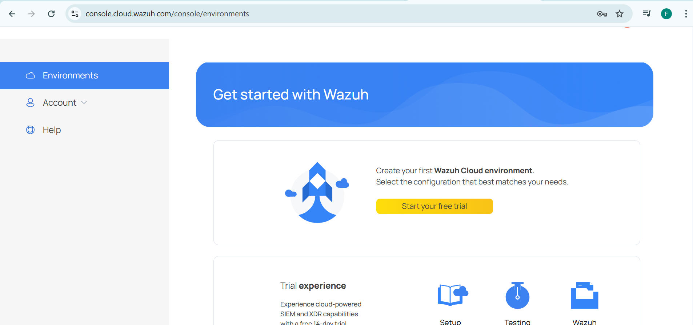
*Wazuh Cloud main interface after successful login.*

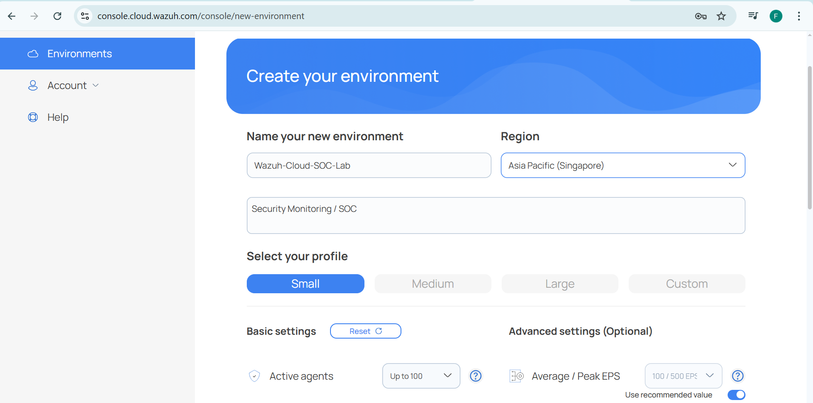
*Creating a new cloud environment and selecting the deployment region.*

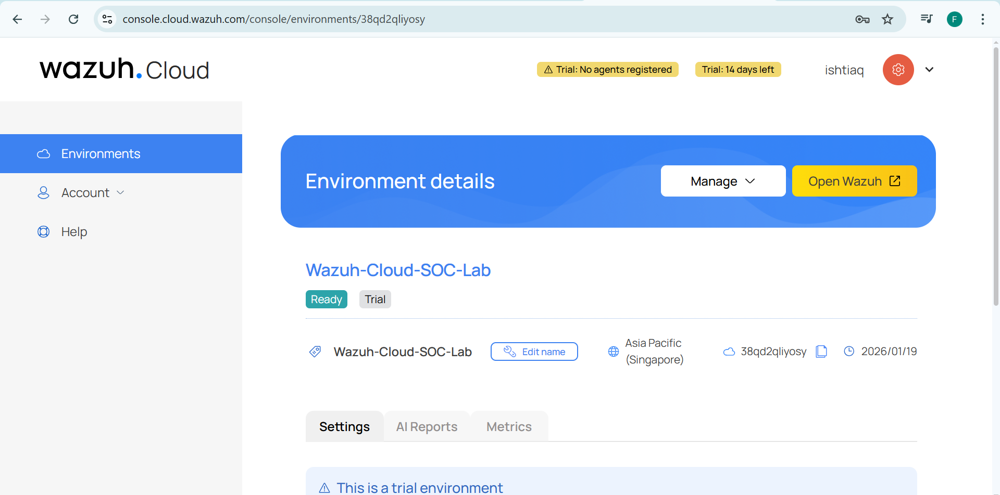
*Wazuh Cloud environment deployed and marked as ready.*

---

### Wazuh Dashboard Access

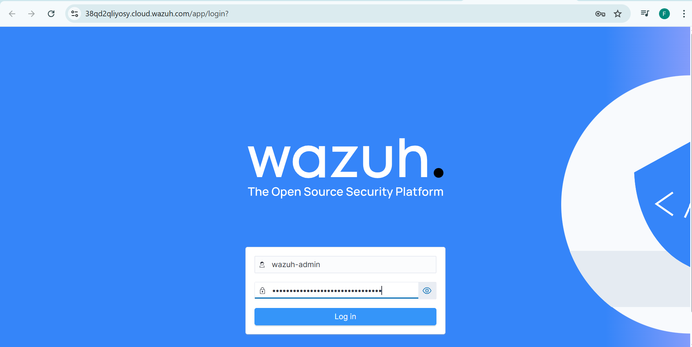
*Secure login to access the Wazuh Dashboard.*

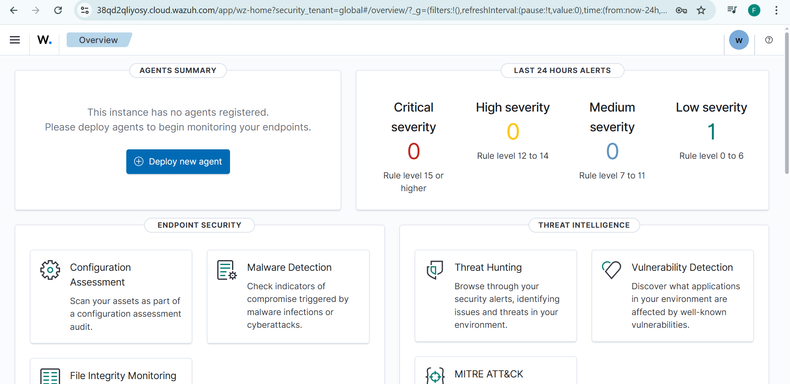
*Wazuh Dashboard providing visibility into agents and security events.*

---

### Agent Deployment & Enrollment

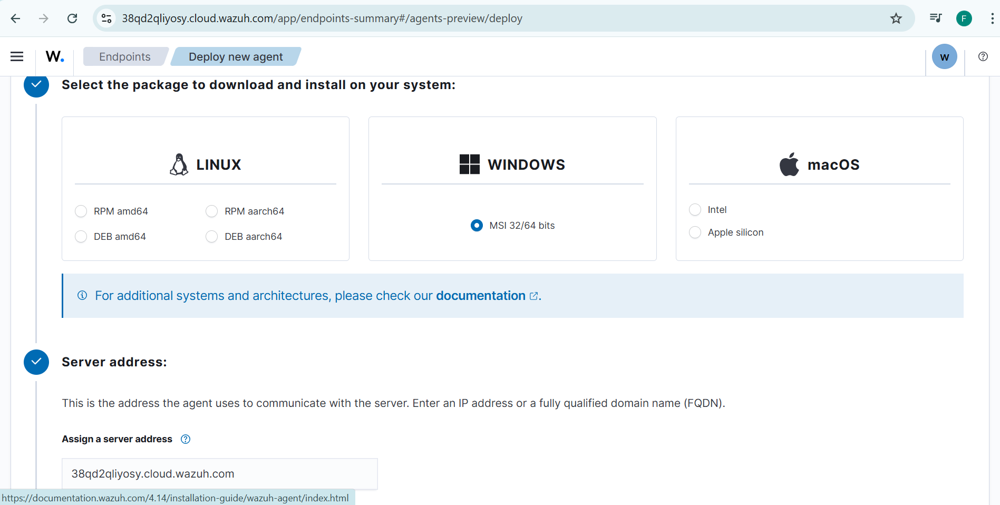
*Selecting Windows OS and viewing server details for agent deployment.*

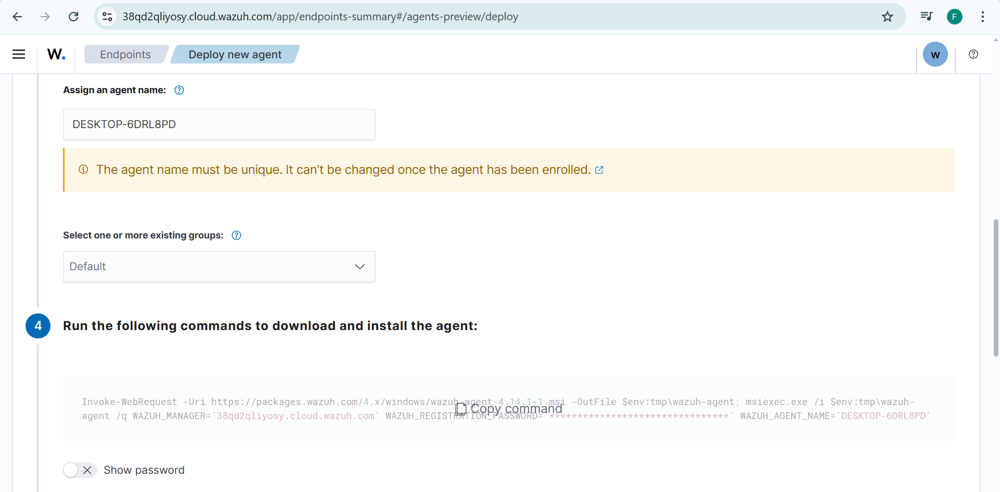
*Generated PowerShell command containing agent enrollment key.*

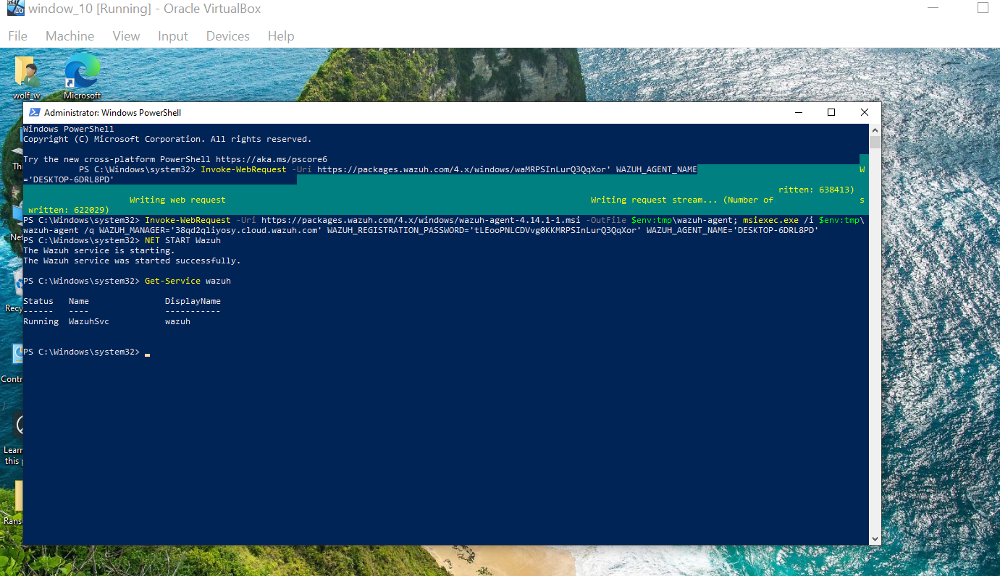
*Installing and starting the Wazuh agent using PowerShell.*

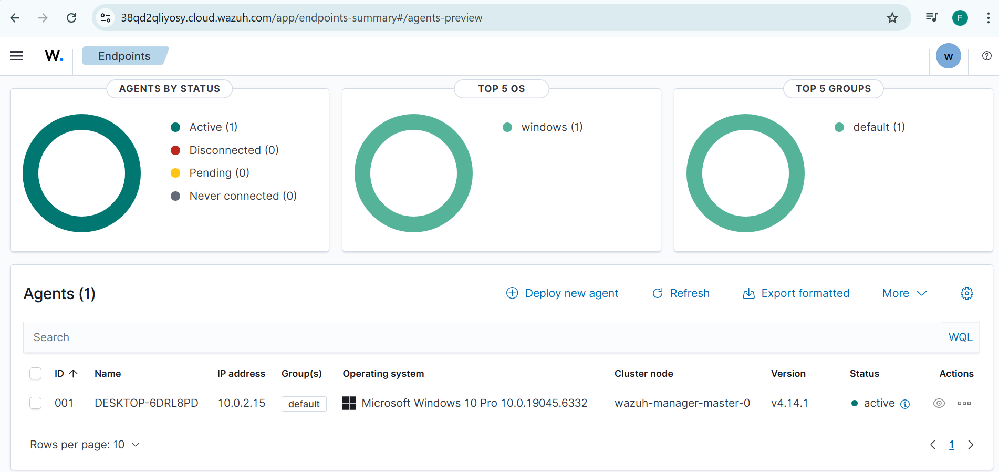
*Windows agent successfully connected and shown as active.*

---

### Log Collection & Alert Testing

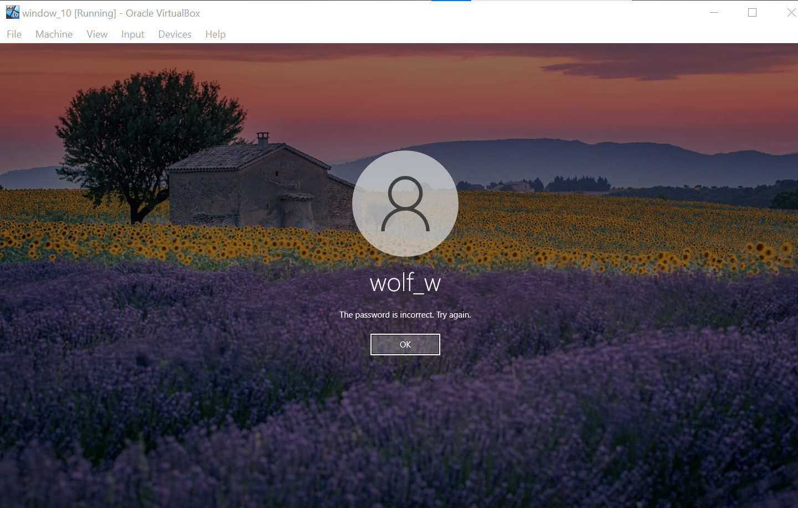
*Simulated failed authentication attempt to generate security events.*

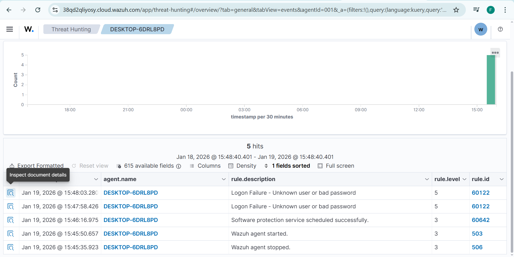
*Authentication failure alert detected in Wazuh Dashboard.*

---

### File Integrity Monitoring (FIM)

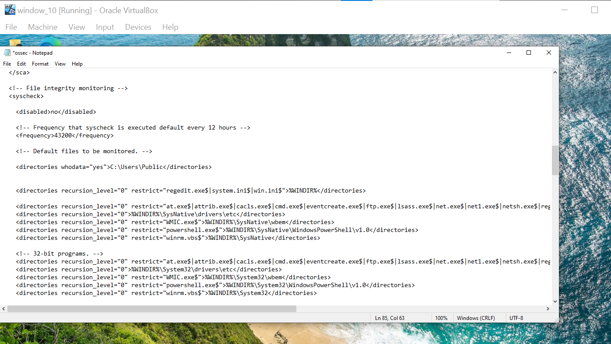
*Configuring File Integrity Monitoring for the Public directory.*

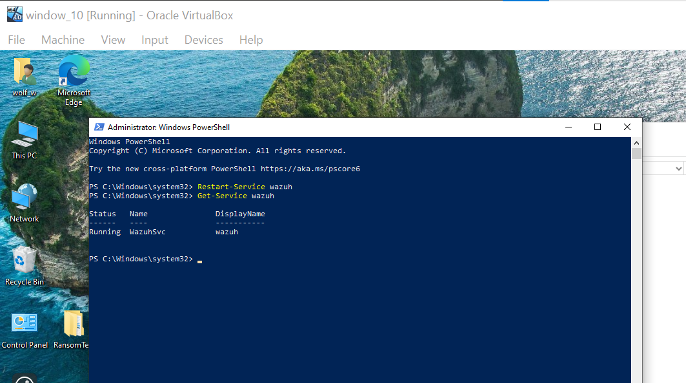
*Restarting the agent to apply FIM configuration changes.*

*Creating files and folders to trigger FIM alerts.*

*File integrity alert successfully generated and visualized.*

## Documentation
- **Full Report (PDF):** `documentation/Wazuh_Cloud_Deployment_Report.pdf`
- **Screenshots:** `screenshots/` directory

---

## Key Results
- Wazuh Cloud environment deployed successfully  
- Windows agent enrolled and marked **Active**  
- Authentication failure events detected and logged  
- File Integrity Monitoring alerts generated correctly  
- Real-time SOC visibility confirmed via dashboard  

---

## Skills Demonstrated
- Cloud-based SIEM deployment  
- SOC monitoring and alert analysis  
- Endpoint security monitoring  
- File Integrity Monitoring (FIM)  
- Incident detection and validation  
- Wazuh dashboard operations  

---

## Author
**Ishtiaq Rashid**  
Aspirant SOC Analyst | Cybersecurity Enthusiast  
Pakistan  

---

## Conclusion
This project simulates real-world SOC analyst responsibilities by deploying and operating a cloud-based SIEM platform. It validates hands-on skills in detection, monitoring, and incident analysis using Wazuh Cloud, closely mirroring enterprise SOC operations.
